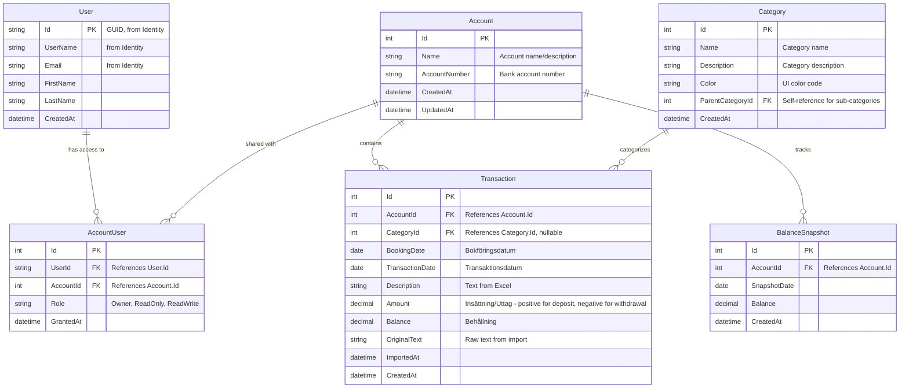

# Budget Tracker Database - ER Diagram

## Overview

This document describes the Entity Relationship (ER) diagram for the Budget Tracker application database, designed to support Excel imports with Swedish bank transaction data.

## ER Diagram

## Table Descriptions

### User
**Purpose:** User accounts for the application (handled by ASP.NET Identity).

**Note:** This table already exists as `ApplicationUser` extending `IdentityUser` and is out of scope for this issue (covered in issue #2).

**Key Fields:**
- `Id` (PK): Unique identifier (GUID from Identity)
- `UserName`, `Email`: Authentication fields (from Identity)
- `FirstName`, `LastName`: User profile information
- `CreatedAt`: Account creation timestamp

### Account
**Purpose:** Represents a bank account that can be shared among multiple users.

**Key Fields:**
- `Id` (PK): Unique identifier
- `Name`: Friendly name for the account
- `AccountNumber`: Bank account number (optional, for reference)
- `CreatedAt`, `UpdatedAt`: Audit timestamps

**Relationships:**
- One Account has many Transactions
- One Account has many BalanceSnapshots
- Many-to-Many with User through AccountUser

### AccountUser (Junction Table)
**Purpose:** Enables account sharing between multiple users with role-based access control.

**Key Fields:**
- `Id` (PK): Unique identifier
- `UserId` (FK): References User
- `AccountId` (FK): References Account
- `Role`: Access level (Owner, ReadOnly, ReadWrite)
- `GrantedAt`: When access was granted

**Relationships:**
- Links Users to Accounts in a many-to-many relationship

### Category
**Purpose:** Categorization of transactions for budgeting and reporting.

**Key Fields:**
- `Id` (PK): Unique identifier
- `Name`: Category name (e.g., "Groceries", "Transportation")
- `Description`: Detailed description
- `Color`: Color code for UI display
- `ParentCategoryId` (FK): Self-reference for hierarchical categories (nullable)
- `CreatedAt`: Creation timestamp

**Relationships:**
- One Category has many Transactions
- Self-referencing for parent-child category hierarchy

### Transaction
**Purpose:** Stores individual bank transactions imported from Excel files.

**Excel Import Mapping:**
- `BookingDate` ← Bokföringsdatum
- `TransactionDate` ← Transaktionsdatum  
- `Description` ← Text
- `Amount` ← Insättning/Uttag (positive for deposits, negative for withdrawals)
- `Balance` ← Behållning

**Key Fields:**
- `Id` (PK): Unique identifier
- `AccountId` (FK): Associated account
- `CategoryId` (FK): Transaction category (nullable - can be categorized later)
- `BookingDate`: Date when transaction was booked
- `TransactionDate`: Actual transaction date
- `Description`: Transaction description from bank
- `Amount`: Transaction amount (positive = deposit, negative = withdrawal)
- `Balance`: Account balance after transaction
- `OriginalText`: Raw text from Excel for reference
- `ImportedAt`: Timestamp when this was imported
- `CreatedAt`: Record creation timestamp

**Relationships:**
- Many Transactions belong to one Account
- Many Transactions belong to one Category (optional)

### BalanceSnapshot
**Purpose:** Periodic snapshots of account balances for historical tracking and graph generation.

**Key Fields:**
- `Id` (PK): Unique identifier
- `AccountId` (FK): Associated account
- `SnapshotDate`: Date of the snapshot
- `Balance`: Balance amount at snapshot time
- `CreatedAt`: When snapshot was created

**Relationships:**
- Many BalanceSnapshots belong to one Account

## Design Considerations

### Excel Import Support
The Transaction table is designed to directly map to the Swedish bank export format:
- **Bokföringsdatum** → `BookingDate`
- **Transaktionsdatum** → `TransactionDate`
- **Text** → `Description`
- **Insättning/Uttag** → `Amount`
- **Behållning** → `Balance`

### Account Sharing
The many-to-many relationship between User and Account through AccountUser enables:
- Shared household accounts
- Business accounts with multiple users
- Role-based access control (Owner, ReadOnly, ReadWrite)

### Categorization
- Categories support hierarchical structure via self-referencing
- Transactions can be categorized after import (CategoryId is nullable)
- UI can use the Color field for visual distinction

### Balance Tracking
Two approaches for balance:
1. **Transaction.Balance**: Balance after each transaction (from Excel)
2. **BalanceSnapshot**: Periodic snapshots for efficient graph generation

This dual approach allows:
- Accurate historical balance from transactions
- Fast query performance for balance graphs using snapshots

### Extensibility
The design allows for future enhancements:
- Adding budgets (link to Category)
- Recurring transactions
- Transaction attachments (receipts)
- Multi-currency support
- Transaction splitting across categories

## Database Technology
PostgreSQL is used as the database (configured via Aspire), providing:
- ACID compliance for financial data
- Advanced date/time handling
- JSON support for future flexibility
- Robust indexing and query performance

## Implementation Notes

This ER diagram serves as the design specification. The actual PostgreSQL table implementation will be handled in a separate issue using:
- Entity Framework Core migrations
- ASP.NET Core for the API layer
- Aspire for orchestration and database provisioning
